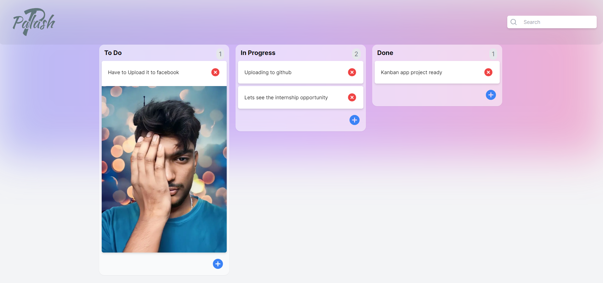

This is a Kanban project inspired by the Trello website. It allows you to manage tasks using Kanban boards, complete with drag-and-drop functionality. You can also add images to your project. To run it on your machine, 

follow these steps:

- **Step 1:** Download the project as a zip file or clone it to your local machine.

- **Step 2:** After opening the project folder in your local code environment, run the following command to install the necessary dependencies using either Yarn or npm:

```bash
yarn install
# OR
npm install
```

- **Step 3:** Start the project with the following command:

```bash
npm run dev
# OR
yarn dev
```

This will run the project on your machine.

- **Step 4:** Open your web browser and type "localhost:3000" in the address bar to access the website.

If the project is not running correctly or encountering issues, follow these additional steps:

- 1. Create environment variables in your AppWrite Cloud Database as needed.
- 2. Create the required database and collection in AppWrite Cloud Database.

Make sure that you configure the environment variables correctly to ensure the project functions as expected.


